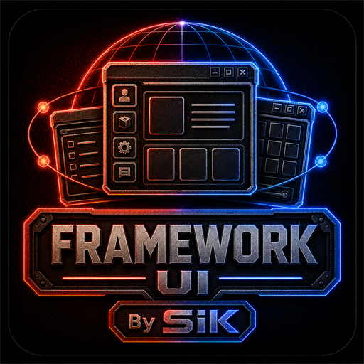

# SiK UI Framework

A standalone client-side composition and lifecycle framework for Project
Zomboid Build 42.20+. It gives SiK products and external consumers one typed
`SiK.UI` namespace for windows, blocks, tables, lists, controls, tabs, input,
resize and disposal. It contains no Global Storage mechanics or product assets.

## Install and use

Subscribe to [Workshop 3794332103](https://steamcommunity.com/sharedfiles/filedetails/?id=3794332103)
and load `SiKUIFramework` before its consumers. A consuming `mod.info` uses
`require=SiKUIFramework`; client UI code loads `SiK_UI` and consumes only
the documented public modules.

Start with the [runtime reference](docs/RUNTIME_REFERENCE.md), [public API](docs/SIK_UI_API.md),
[component catalog](docs/SIK_UI_COMPONENT_CATALOG.md), [window contract](docs/WINDOW.md)
and [tabs contract](docs/TABS.md).

| Version | Mod ID | Workshop ID | Build | Support |
| --- | --- | --- | --- | --- |
| 1.0.1 | SiKUIFramework | 3794332103 | 42.20+ | MAINTAINED |

The framework is a required client dependency for current SiK products.
Compatibility with a consumer is only confirmed when that consumer names and
tests the dependency; framework availability alone does not certify an
integration.

Report reproducible defects through the official
[Global Storage SiK repository](https://github.com/Kavalieri/GlobalStorageSiK/issues).
Include the consumer Mod ID, versions, game mode, resolution, steps and actual
result. New consumers should propose the smallest public, data-driven contract
they need rather than importing internals.

## Español

Framework independiente de cliente para componer y gestionar interfaces en
Project Zomboid Build 42.20+. Ofrece un único namespace tipado `SiK.UI` para
ventanas, bloques, tablas, listas, controles, pestañas, input, resize y
limpieza. No contiene mecánicas ni recursos de Global Storage.

Suscríbete al [Workshop 3794332103](https://steamcommunity.com/sharedfiles/filedetails/?id=3794332103)
y carga `SiKUIFramework` antes de los mods consumidores. Informa fallos
reproducibles en el repositorio oficial indicando Mod ID consumidor, versiones,
modo, resolución, pasos y resultado real.

## ❤️ Support development

SiK mods remain free. Voluntary support through
[GitHub Sponsors](https://github.com/sponsors/Kavalieri) does not unlock
features, exclusive gameplay, priority or guaranteed support.

## ❤️ Apoya el desarrollo

Global Storage SiK y sus addons son gratuitos y seguirán siéndolo. Si quieres
apoyar su desarrollo, pruebas y mantenimiento, puedes hacerlo mediante
[GitHub Sponsors](https://github.com/sponsors/Kavalieri).

El apoyo es completamente voluntario y no desbloquea funciones, contenido ni
ventajas de juego exclusivas.

## Licence and notices

See [LICENSE.md](LICENSE.md), [NOTICE.md](NOTICE.md),
[CONTRIBUTING.md](CONTRIBUTING.md), [SECURITY.md](SECURITY.md),
[MAINTENANCE_STATUS.md](MAINTENANCE_STATUS.md) and
[THIRD_PARTY_NOTICES.md](THIRD_PARTY_NOTICES.md).

This project uses AI assistance, including Codex and Claude, during parts of
design, documentation and development. Product decisions, review and
publication remain with the SiK team.
